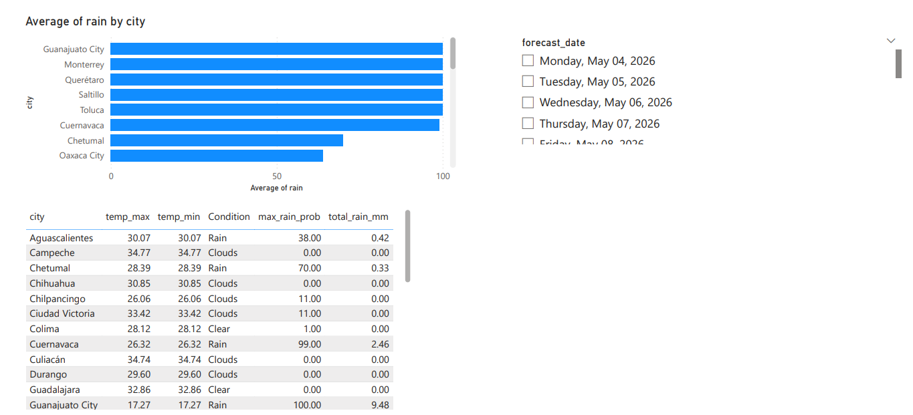

# 🌤️ AWS Weather End-to-End ELT Pipeline

An end-to-end serverless ELT pipeline that ingests, loads, and transforms real-time and forecast weather data across **32 Mexican state capitals** using AWS and dbt, visualized in Power BI.

---

## 🏗️ Architecture

```
OpenWeather API (Current Weather + 5-Day Forecast)
          ↓
AWS Lambda (Python) — extraction and JSON flattening
          ↓
Amazon S3 — Bronze Layer (raw partitioned JSONL)
          ↓
dbt Core + Amazon Athena — SQL transformations (ELT)
          ↓
Amazon S3 — Silver Layer (clean, typed Parquet tables)
          ↓
Amazon S3 — Gold Layer (aggregations and KPIs in Parquet)
          ↓
Power BI — Interactive Dashboard (via Athena ODBC)

Orchestration: EventBridge (Lambda triggers) + GitHub Actions (partition sync + dbt run every hour)
```

---

## 📦 Tech Stack

| Layer | Tool |
|---|---|
| Source | OpenWeather API (Current Weather + 5-Day Forecast) |
| Extraction | AWS Lambda (Python 3.12) |
| Storage | Amazon S3 (Medallion Architecture) |
| Query Engine | Amazon Athena v3 (Serverless) |
| Transformation | dbt Core + dbt-athena-community |
| Orchestration | Amazon EventBridge + GitHub Actions |
| Visualization | Power BI (Azure Maps) |

---

## 🥉🥈🥇 Medallion Architecture (ELT)

```
s3://weather-pipeline-merida/
├── bronze/
│   ├── current/          ← JSONL per ingestion run (32 cities per file)
│   └── forecast/         ← JSONL with 40 records × 32 cities per call
├── silver/
│   ├── silver_current_weather/   ← clean data, Kelvin → Celsius, Parquet
│   └── silver_forecast/          ← clean forecast with rain probability, Parquet
├── gold/
│   ├── gold_daily_summary/       ← daily weather summary per city, Parquet
│   └── gold_forecast_daily/      ← daily aggregated forecast per city, Parquet
└── athena-results/       ← Athena query results
```

---

## ⚡ Automation

| Process | Trigger | Frequency |
|---|---|---|
| Lambda Current Weather | EventBridge | Every 2 hours |
| Lambda Forecast | EventBridge | Every 3 hours |
| Partition sync + dbt run | GitHub Actions | Every hour |

---

## 🌎 Coverage

**32 Mexican state capitals:**

Aguascalientes · Mexicali · La Paz · Campeche · Tuxtla Gutiérrez · Chihuahua · Saltillo · Colima · Durango · Guanajuato · Chilpancingo · Pachuca · Guadalajara · Toluca · Morelia · Cuernavaca · Tepic · Monterrey · Oaxaca · Puebla · Querétaro · Chetumal · San Luis Potosí · Culiacán · Hermosillo · Villahermosa · Ciudad Victoria · Tlaxcala · Xalapa · Mérida · Zacatecas · Ciudad de México

---

## 🔧 dbt Models

```
models/
├── silver/
│   ├── sources.yml                  ← bronze table definitions
│   ├── silver_current_weather.sql   ← cleaning, unit conversion, Parquet
│   └── silver_forecast.sql          ← forecast cleaning, rain probability, Parquet
└── gold/
    ├── gold_daily_summary.sql       ← daily avg/max/min per city, Parquet
    └── gold_forecast_daily.sql      ← 5-day forecast aggregated per city, Parquet
```

**Transformations applied:**
- Temperature conversion Kelvin → Celsius
- Nested JSON fields extracted to flat columns in Lambda
- `COALESCE` on rain fields (field absent when no rain)
- Unix timestamp converted to readable datetime
- Rain probability from 0–1 to percentage (0–100%)
- Daily aggregations: avg, max, min, sum per city
- Output format: Parquet (columnar, optimized for Athena queries)

---

## 📊 Dashboard

Built in Power BI connected to Amazon Athena via ODBC, using Azure Maps for geographic visualization.

**Page 1 — Current Weather**
- Temperature per city bar chart (blue → red gradient)
- Humidity per city bar chart
- Hottest city, coldest city, wettest city KPI cards (DAX)
- Azure Maps with city markers
- Date slicer

**Page 2 — 5-Day Forecast**
- Rain probability per city bar chart
- Forecast table: city, temp max/min, rain probability, condition
- Date slicer

---


---

## 📊 Dashboard Insights

The Power BI dashboard provides a comprehensive view of weather conditions across the 32 Mexican state capitals, structured into two main analytical views:

<p align="center">
  
  
</p>

### Key Features:
* **Real-Time Monitoring (Mexico Now):** Displays current temperature, humidity, and weather conditions per city. It includes a dynamic temperature gradient (blue to red) and KPI cards for extreme values (Hottest, Coldest, and Wettest cities).
* **Geospatial Analysis:** Integrated Azure Maps with city markers to visualize geographic weather patterns across the country.
* **Predictive Insights:** A 5-day forecast view tracking rain probability and temperature trends to support data-driven planning.
* **Data Integrity:** All visualizations are powered by the "Gold" layer in Amazon S3, ensuring that metrics are pre-aggregated and validated through dbt tests.


## 💰 Estimated Cost

| Service | Cost/month |
|---|---|
| AWS Lambda | $0.00 |
| Amazon S3 | ~$0.05 |
| Amazon Athena | ~$1.50 |
| Amazon EventBridge | $0.00 |
| Amazon CloudWatch + SNS | ~$0.05 |
| GitHub Actions | $0.00 |
| **Total** | **~$1.60/month** |

> Without continuous execution the cost is practically $0.00/month.

---

## 🔐 Security

- Dedicated IAM user with least privilege policies per service
- API keys stored as Lambda environment variables (never hardcoded)
- AWS credentials in GitHub Actions via Secrets (never in code)
- dbt `profiles.yml` excluded from repository via `.gitignore`
- S3 bucket with public access blocked

---

## 🚀 Setup

### 1. Prerequisites
- AWS account
- Python 3.11+
- dbt-athena-community
- Power BI Desktop

### 2. Lambda Environment Variables
```
OPENWEATHER_API_KEY  → your OpenWeather API key
S3_BUCKET            → S3 bucket name
```

### 3. GitHub Secrets
```
AWS_ACCESS_KEY_ID
AWS_SECRET_ACCESS_KEY
```

### 4. Run dbt locally
```bash
python -m venv dbt-env
dbt-env\Scripts\activate
pip install dbt-athena-community
cd weather_pipeline
dbt run
```